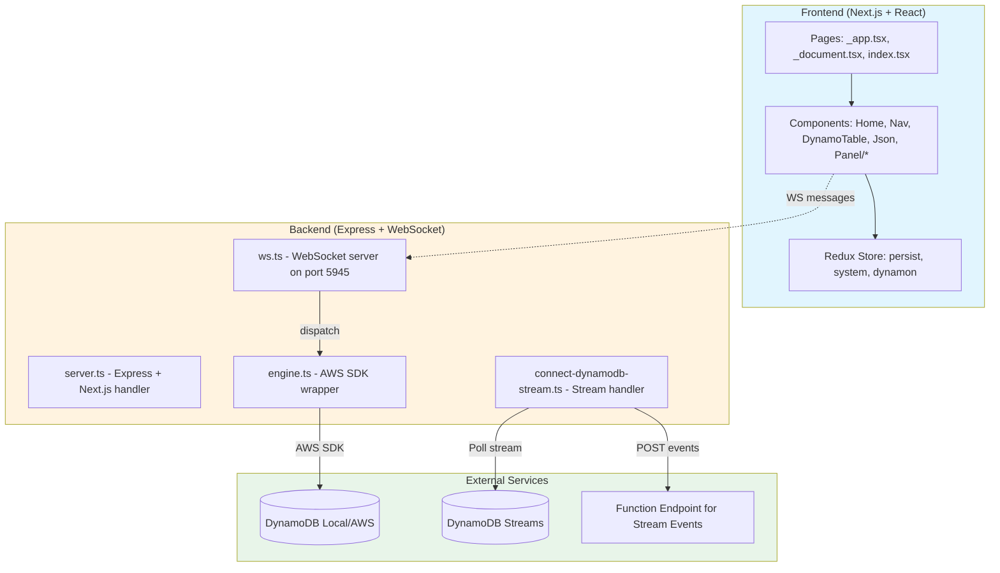

# Dynamon Architecture Review

**Repository:** https://github.com/nathistant/dynamon-forked  
**Original:** https://github.com/deptno/dynamon  
**Review Date:** April 13, 2026  
**Version:** 0.3.11  

---

## Executive Summary

Dynamon is a GUI client for DynamoDB, designed to work with both local DynamoDB (via Docker) and AWS-hosted DynamoDB instances. The project provides a web-based interface for managing tables, documents, and streams.

**Status:** ⚠️ **ARCHIVED PROJECT** - Original repository was archived by the owner on January 28, 2020.

---

## Architecture Diagram



---

## Tech Stack Summary

| Layer | Technology | Version | Purpose |
|-------|-----------|---------|---------|
| **Framework** | Next.js | 8.0.0-canary.2 | React framework with SSR |
| **Language** | TypeScript | 3.1.6 | Type-safe JavaScript |
| **UI Library** | React | 16.8.0-alpha | UI components |
| **State Management** | Redux + Thunk | 4.0.0 | App state management |
| **CSS Framework** | BlueprintJS | 3.7.0 | UI component library |
| **CSS Utility** | Tachyons | 4.11.1 | Atomic CSS |
| **Backend** | Express | 4.16.4 | HTTP server |
| **Real-time** | WebSocket (ws) | 6.1.0 | Bi-directional communication |
| **AWS SDK** | aws-sdk | 2.347.0 | DynamoDB operations |
| **ORM-ish** | Dynalee | 0.1.7 | DynamoDB abstraction layer |
| **Utilities** | Ramda | 0.25.0 | Functional programming |
| **Build** | Babel + Webpack | - | Transpilation |
| **Test** | Jest + Enzyme | 23.6.0 | Unit testing |
| **CI/CD** | CircleCI | 2.0 | Continuous integration |

---

## Project Structure

```
dynamon/
├── pages/                    # Next.js pages
│   ├── _app.tsx             # App wrapper
│   ├── _document.tsx        # HTML document
│   └── index.tsx            # Main page
├── src/
│   ├── components/          # React components
│   │   ├── Nav.tsx          # Navigation
│   │   ├── Home.tsx         # Main view
│   │   ├── DynamoTable.tsx  # Table display
│   │   ├── Json.tsx         # JSON editor
│   │   ├── TableCreator.tsx # Create table UI
│   │   ├── SelectTable.tsx  # Table selector
│   │   ├── panel/           # Search/Scan/Query panels
│   │   └── react-deep-json-table/ # Custom table component
│   ├── redux/               # State management
│   │   ├── index.ts         # Root reducer
│   │   ├── dynamon/         # DynamoDB state
│   │   ├── system/          # System state
│   │   └── persist/         # Persistence state
│   ├── constants/           # Environment constants
│   └── @types/              # Type definitions
├── backend/                  # Server-side code
│   ├── engine.ts            # AWS SDK wrapper
│   ├── ws.ts                # WebSocket server
│   ├── connect-dynamodb-stream.ts  # Stream handling
│   └── util.ts              # Utilities
├── server.ts                # Express server setup
├── dynamon.ts               # CLI entry point
├── dynamon-action-types.ts  # Action type definitions
├── next.config.ts           # Next.js configuration
├── package.json             # Dependencies
└── tsconfig.json            # TypeScript configuration
```

---

## Database Schema

Dynamon is a **GUI client** and does not define its own database schema. Instead, it dynamically interacts with DynamoDB tables.

### Key Data Structures:

#### Endpoint Configuration
```typescript
interface Endpoint {
  name: string      // Display name (e.g., "US East (Ohio)")
  region: string    // AWS region (e.g., "us-east-1")
  endpoint: string // Full URL (e.g., "dynamodb.us-east-1.amazonaws.com")
}
```

#### Default Endpoints (Hardcoded in ws.ts)
- 19 pre-configured AWS regions
- Local DynamoDB: `http://localhost:8000` with region `dynamon`

### Table Metadata Cache
- Tables and their schemas are fetched dynamically via `listTables` and `describeTable`
- Models are cached using composite key: `{tableName}#{hashKey}#{rangeKey}`

---

## API Endpoints & Communication

### WebSocket Actions (Port 5945)

| Action Type | Direction | Description |
|-------------|-----------|-------------|
| `WS_CONNECTED` | Server → Client | Connection established |
| `ADD_ENDPOINT` | Client → Server | Add custom endpoint |
| `READ_ENDPOINTS` | Client → Server | List configured endpoints |
| `OK_READ_ENDPOINTS` | Server → Client | Endpoint list response |
| `READ_TABLES` | Client → Server | List tables |
| `OK_READ_TABLES` | Server → Client | Table list response |
| `CREATE_TABLE` | Client → Server | Create new table |
| `OK_CREATE_TABLE` | Server → Client | Table created confirmation |
| `DELETE_TABLE` | Client → Server | Delete table |
| `OK_DELETE_TABLE` | Server → Client | Table deleted confirmation |
| `READ_DOCUMENTS` | Client → Server | Scan table documents |
| `OK_READ_DOCUMENTS` | Server → Client | Document list response |
| `CREATE_DOCUMENT` | Client → Server | Insert single document |
| `OK_CREATE_DOCUMENT` | Server → Client | Document created confirmation |
| `UPDATE_DOCUMENT` | Client → Server | Update document |
| `OK_UPDATE_DOCUMENT` | Server → Client | Update confirmation |
| `DELETE_DOCUMENT` | Client → Server | Delete document |
| `OK_DELETE_DOCUMENT` | Server → Client | Delete confirmation |
| `CREATE_DOCUMENTS` | Client → Server | Batch insert |
| `OK_CREATE_DOCUMENTS` | Server → Client | Batch insert confirmation |
| `SCAN` | Client → Server | Scan with filters |
| `OK_SCAN` | Server → Client | Scan results |
| `QUERY` | Client → Server | Query operation |
| `OK_QUERY` | Server → Client | Query results |
| `CONNECT_STREAM` | Client → Server | Start stream polling |
| `DISCONNECT_STREAM` | Client → Server | Stop stream polling |

### HTTP Endpoints

| Endpoint | Method | Description |
|----------|--------|-------------|
| `/*` | GET | Next.js SSR handler (all routes) |

### DynamoDB Stream Integration

- **Polling Interval:** 1000ms
- **Endpoint:** `POST` to configurable `functionEndpoint`
- **Payload:** AWS DynamoDB Stream Records format

---

## Security Audit (Quick Pass)

### ⚠️ Critical Issues

1. **No Authentication/Authorization**
   - No login mechanism
   - No AWS credential validation
   - Direct AWS SDK access with implicit credentials

2. **Hardcoded AWS Endpoints**
   - Endpoints array hardcoded in `backend/ws.ts`
   - Includes GovCloud and China regions

3. **No Input Sanitization**
   - Direct pass-through of user input to AWS SDK
   - Potential for injection attacks

4. **No HTTPS Enforcement**
   - HTTP endpoints allowed (intentional for local DynamoDB)
   - WebSocket server on plain WS (not WSS)

### ⚠️ Warning Issues

5. **Dependency Vulnerabilities**
   - `aws-sdk` v2.347.0 (December 2018) - likely has security patches available
   - `next` 8.0.0-canary.2 - pre-release version
   - Multiple dependencies are 5+ years old

6. **No Rate Limiting**
   - No protection against brute force
   - No request throttling

7. **In-Memory Caching Issues**
   - `ddbs`, `ddbClients`, `models` stored in memory without TTL
   - Could lead to memory leaks with many endpoints

8. **Debug Mode Exposes Information**
   - `DEBUG=*` environment variable can expose sensitive data

### ✅ Security Positives

- No hardcoded AWS credentials
- Uses AWS SDK standard credential chain
- Apache 2.0 license (permissive)

---

## Performance Considerations

### Current Limitations

| Aspect | Current | Issue |
|--------|---------|-------|
| **Query Limit** | 100 items | `Limit: 100` hardcoded in `listRecords` |
| **Pagination** | Partial | `LastEvaluatedKey` supported but not fully utilized |
| **Stream Polling** | 1 second | Fixed interval, no backoff |
| **Caching** | In-memory | No distributed cache |
| **Concurrent Connections** | Unlimited | No connection limiting |
| **Bundle Size** | Unknown | No code splitting visible |

### Potential Bottlenecks

1. **Synchronous Table Schema Fetching**
   ```typescript
   // In engine.ts - serial execution
   Promise.all(list.TableNames.map(async TableName => {
     const {Table} = await ddb.describeTable({TableName}).promise()
     return Table
   }))
   ```

2. **No Request Debouncing**
   - Rapid UI interactions could overwhelm backend

3. **Full Table Scans**
   - Default `scan()` without filters can be expensive

### Positive Performance Features

- Model caching reduces schema lookups
- WebSocket reduces polling overhead
- Redux state persistence available

---

## Deployment Readiness

### Current State: ⚠️ NOT PRODUCTION-READY

#### Deployment Requirements

| Requirement | Status | Notes |
|-------------|--------|-------|
| **Docker Support** | ❌ Missing | No Dockerfile |
| **Environment Config** | ⚠️ Partial | Some values in `src/constants/env.ts` |
| **Health Checks** | ❌ Missing | No `/health` endpoint |
| **Logging** | ⚠️ Basic | `filename-logger` with debug levels |
| **Monitoring** | ❌ Missing | No metrics collection |
| **Graceful Shutdown** | ❌ Missing | No SIGTERM handling |
| **Port Configuration** | ⚠️ Hardcoded | Express: 5500, WS: 5945 |
| **Secrets Management** | ❌ None | Relies on AWS credential chain |

#### Recommended Dockerfile

```dockerfile
FROM node:10-alpine
WORKDIR /app
COPY package*.json ./
RUN npm ci --only=production
COPY . .
RUN npm run build
EXPOSE 5500 5945
CMD ["node", "server.js"]
```

---

## Potential Improvements

### High Priority

1. **Security Hardening**
   - [ ] Add authentication layer (OAuth, JWT)
   - [ ] Implement input validation (Joi/Zod)
   - [ ] Add rate limiting
   - [ ] Enable HTTPS/WSS
   - [ ] Add CSP headers

2. **Dependency Updates**
   - [ ] Upgrade to Next.js 14+ (current: 8.0.0-canary.2)
   - [ ] Upgrade to React 18+ (current: 16.8.0-alpha)
   - [ ] Upgrade to TypeScript 5+
   - [ ] Upgrade all dependencies to latest stable
   - [ ] Migrate from tslint to eslint

3. **Production Readiness**
   - [ ] Add Dockerfile
   - [ ] Implement health checks
   - [ ] Add graceful shutdown
   - [ ] Configure environment-based ports
   - [ ] Add structured logging (Winston/Pino)

### Medium Priority

4. **Performance**
   - [ ] Implement cursor-based pagination
   - [ ] Add Redis caching layer
   - [ ] Add request debouncing
   - [ ] Implement virtual scrolling for large tables

5. **Testing**
   - [ ] Increase test coverage (currently minimal)
   - [ ] Add E2E tests (Cypress/Playwright)
   - [ ] Add load tests

6. **Features**
   - [ ] Complete TODOs in engine.ts (query, updateDocument)
   - [ ] Add batch delete documents
   - [ ] Add table edit functionality
   - [ ] Support for DynamoDB transactions

### Low Priority

7. **Developer Experience**
   - [ ] Add Storybook for component documentation
   - [ ] Implement hot reload for backend
   - [ ] Add pre-commit hooks
   - [ ] Add API documentation (OpenAPI)

8. **Architecture**
   - [ ] Migrate to modern state management (Zustand/Recoil)
   - [ ] Consider tRPC for type-safe APIs
   - [ ] Add proper error boundaries

---

## Summary Matrix

| Category | Score | Notes |
|----------|-------|-------|
| **Architecture** | 6/10 | Clear separation but outdated patterns |
| **Security** | 3/10 | Multiple critical vulnerabilities |
| **Performance** | 5/10 | Basic optimizations, some bottlenecks |
| **Maintainability** | 4/10 | Old dependencies, no type safety in parts |
| **Deployment** | 2/10 | Not production-ready |
| **Documentation** | 5/10 | Good README, inline TODOs |
| **Overall** | 4.2/10 | Requires significant modernization |

---

## Conclusion

Dynamon was a well-intentioned project that provided a useful GUI for DynamoDB, particularly for local development. However, it has been **archived since January 2020** and is significantly outdated:

- **79 major version bumps** behind current Next.js
- **React alpha version** used (before hooks were stable)
- **Security vulnerabilities** in dependencies
- **No production hardening**

**Recommendation:** This fork should be treated as a reference/archived codebase. For production use, consider:
1. [NoSQL Workbench for DynamoDB](https://docs.aws.amazon.com/amazondynamodb/latest/developerguide/workbench.html) (Official AWS tool)
2. [Dynobase](https://dynobase.dev/) (Modern alternative)
3. Complete rewrite using current best practices

---

*Review completed by SubAgent*  
*Fork Location: https://github.com/nathistant/dynamon-forked*
